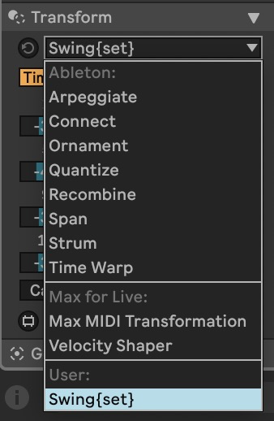
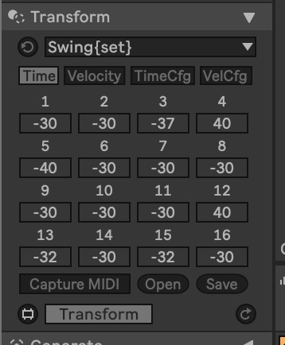
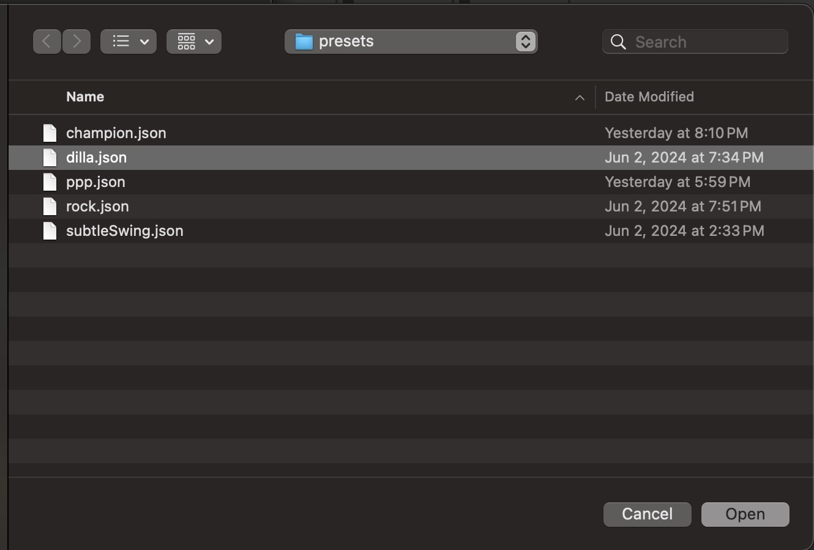
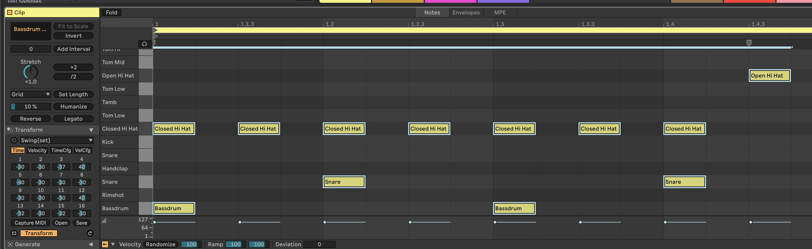
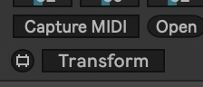
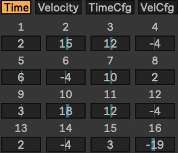
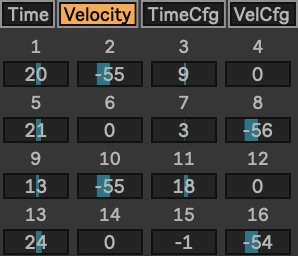
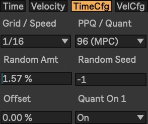
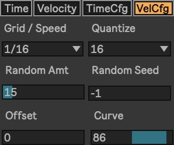

# Swing{set} User Guide

## Quickstart
- Select Swing{set} under user MIDI Transformers.

- If interface is disabled (greyed out), select at least 1 midi note to enable the transformer.

- Click Open Button

- In the pop up menu, select "dilla.json" preset file ([download here](../presets/dilla.json)).

- Select the notes you wish to transform (recommend a full drum pattern to start).

- Click "Transform"

## Parameter Guide

### Time

16 Live numberbox sliders from -100 to 100. The integer values for each slot translate to an offset of -0.5 to 0.5 step timing offset. The size of the step is determined by the the Grid / Speed parameter in the TimeCfg menu (defaults to 1/16). When transformer is applied, note starts found on the step indicated by a slider's number (loops after 16 steps) at the resolution set by Grid/Speed are offset by the amount specified on the slider. Note starts found between two steps will have their offsets interpolated between the two steps values, providing a smooth transition between offset values.

### Velocity

16 Live numberbox sliders from -127 to 127. The integer values for each slot translate to an offset of -127 to 127 step velocity offset. The size of the step is determined by the the Grid / Speed parameter in the VelCfg menu (defaults to 1/16). When transformer is applied, note velocity found on the step indicated by a slider's number (loops after 16 steps) at the resolution set by Grid/Speed are offset by the amount specified on the slider. Note starts found between two steps will have their velocity offsets interpolated between the two steps values, providing a smooth transition between offset values.

### TimeCfg

#### Grid / Speed

The grid resolution which is used as the basis for the time offsets. It also has the effect of "speeding up" or "slowing down" the "sequence" of offsets on the Time tab. Defaults to 1/16 notes.

#### PPQ / Quant

Applies a quantization setting to the calculated start time + offset. Values are based around PPQ (Pulse Per Quarter Note)

#### Random Amt

The amount of random offset applied to a given note's start time. The random amount range from -0.5 step to 0.5 step x random amount percentage.

#### Random Seed

The "seed" of the randomization. -1 is purely pseudorandom (no seed). Any other number is a consistent randomization [seed](https://en.wikipedia.org/wiki/Random_seed) which is applied based on a passed note's [id](https://docs.cycling74.com/max8/vignettes/live_miditools). Thus the randomization is consistent between tranform applications.

#### Offset.

A fixed amount of positive or negative time offset. Ranges from -0.5 step to 0.5 step (displayed as -100 - 100).

#### Quant On 1

When enabled, calculates the first start of the post offset note, then aligns the entire sequence to landing perfectly on the "One" of the sequence. All other notes are then offset in relation to the "On 1" note while keeping their original distance to it. Saves the user the effort of a manual offset realignment.

### VelCfg

#### Grid / Speed

The grid resolution which is used as the basis for the velocity offsets on the "velocity" tab. It has the efect of "speeding up" or "slowing down" the "sequence" of offsets. Defaults to 1/16 notes.

#### Quantize

Applies a velocity quantization similar to a 16-levels mode (or 64 levels mode, 8 levels mode, etc.) found in MPCs. Emulates the behavior of playing a series of pads with fixed velocity values.

#### Random Amt

The amount of random offset applied to a given note's velocity. The random amount range from -127 to 127.

#### Random Seed

The "seed" of the randomization. -1 is purely pseudorandom (no seed). Any other number is a consistent randomization [seed](https://en.wikipedia.org/wiki/Random_seed) which is applied based on a passed note's [id](https://docs.cycling74.com/max8/vignettes/live_miditools). Thus the randomization is consistent between tranform applications.

#### Offset

A fixed amount of positive or negative velocity offset. Ranges from -127 to 127.

#### Curve

Applies a velocity curve adjustment to the incoming velocity values based on a quadratic bezier curve formula. The effect is similar to a MIDI compressor (positive values) /expander (negative values). Ranges from -100 (very expanded) to 100 (very compressed)

### Capture MIDI

Similar to Ableton's [groove extract](https://www.ableton.com/en/live-manual/11/using-grooves/#extracting-grooves). Selecting a range of notes, enabling "Capture MIDI", then clicking "Transform" will calculate the offsets to be rendered into the individual step numberbox so that it can be re-used on other MIDI sequences after.

### Open

Opens a file browser menu for opening an existing json-based Swing{set} preset file.

### Save

Opens a file browser menu for saving to disk a json-based preset file.

## Effect Apply Order

Changes to notes are applied in this specified order. Note in particular since velocity offsets are calculated AFTER time offsets, the velocity sequencer calculates note velocity based on the post-transformation start point for the note, not the pre-transformation start point

### Overall

1. Time
2. TimeCfg
3. Velocity
4. VelCfg

### Time Config

1. Randomization
2. Fixed Offset
3. Quantize/Align on 1 (if enabled).
4. Quantize notes.

### Velocity Config

1. Randomization
2. Fixed Offset
3. Velocity Curve
4. Quantize Velocity
5. Truncate Velocity (Limit to 1 - 127 values)

## Converting from a .adg groove preset
- Drag and drop an .adg file to an empty midi clip as described [here](https://www.ableton.com/en/live-manual/11/using-grooves/#editing-grooves).
- Select all rendered midi notes.
- Click "Capture MIDI"
- Click "Transform"
- Adjust configuration settings to roughly match the original groove preset.
- Save to .json preset.

## Converting to a .adg groove preset
- Create a midi clip
- Load desired Swing{set} json preset
- Place a series of notes of the same pitch at the smallest resolution between the grid / speed settings of time and velocity.
- Select all notes of the clip.
- Apply the transformation of the preset.
- Select all note of the transformed clip
- Right click -> Extract Grooves
- Adjust Groove parameters until groove roughly matches the feel of the Swing{set} preset.
- Click the "save" icon under the groove settings.